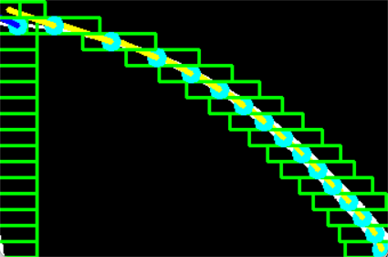

# 5.1日 车道线检测 v2.0.0 版本解释

目前仍然采用滑动窗口法的变种

### 算法思路

首先对读取的图片进行在黄色空间的提取和滤波得到二值化的车道线图片$image\_handle$函数（李尚怡）。

$find\_lane\_pixels$为提取车道线函数，算法如下：

1. 对图片分为左右两个视野，分别按行寻找非零部分，如果视野全暗，将视野扩大，直到视野中出现非零部分（车道线）
2. 按列求和得到非零的“频数图”，得到最大列的索引，**和上一帧的起点对比，允许阈值之内的跳变，否则相信上一个起点**
3. 对窗口数循环（这里是16），对于窗口内点数大于阈值的进行操作：窗口中心选为上个点预测的位置，分别计算左右窗口内的车道点的平均值作为**标志点**，将窗口内最上部分点的横坐标平均值减去最下部分点的平均值作为**梯度【0】**，将固定窗口的高度作为**梯度【1】**，将梯度横坐标和存储的先验方向加权求和，满足已搜窗口数的梯度权重一致。更新先验方向。**预测下一个窗口的横坐标为当前窗口标志点横坐标加上当前的梯度方向**。
4. 对于窗口内点数小于阈值的进行操作：窗口中心选为上个点预测的位置，梯度记为0，更新先验方向（这里将0梯度更新进去是稀释先验方向，因为我盲走越多，越不能相信久远的先验方向，而应该直走）
5. 循环3，4步

### 设计说明

- 视野扩大：当视野中看不到车道线的时候，选择扩大视野，（在十字路口近处车道线缺失的时候，需要远处的车道线补齐），这个trick需要讨论一下
- 不允许跳变，因为车道线一般来讲是连续的，在左边消失的车道线也应该从左边重新出现。但是会限制十字路口的不连续车道线的识别灵敏度，这个参数需要调，目前$self.tolerance = 23$
- 先验方向，目的是指导没有点的时候，窗口的走向，希望可以弥补十字路口的断层或其他窗口内缺失足够点的情况。目前得到的先验方向权重一致，这点还需要讨论。在内部有点的时候没有采用先验方向，因为在远处，变化曲率变大，梯度纠正不过来，跟随不灵敏。
- 梯度，目前梯度有两个形式，一个是没有进行单位化的，用于预测下一窗口的中心位置和更新先验方向，理由：保留了大小关系而不是相对大小关系，数值大也更能对先验方向产生影响。

### 仍存在的问题

当视野中的车道线只存在一条时，会存在重合

因为不允许阈值外跳变，存在更新不及时，需要调整阈值参数

不知道怎么解决

由上一张图片引起的，回不去了......

### 下一版本工作

- [ ] 减枝“重和点”
- [ ] 十字路口利用梯度信息，将梯度变化剧烈的方向剔除，认为没有检测到车道线，按照窗口内点数小于阈值的进行操作
- [ ] 调跳变参数
- [ ] 先验方向，是否可以采用新的更新存储方式，如只用几个窗口的梯度计算先验方向，理由：太久远的方向对此刻没有价值。
- [ ] 将窗口的宽度改变为自适应，用没单位化的梯度调节